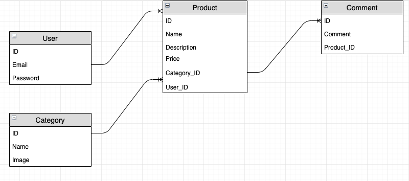
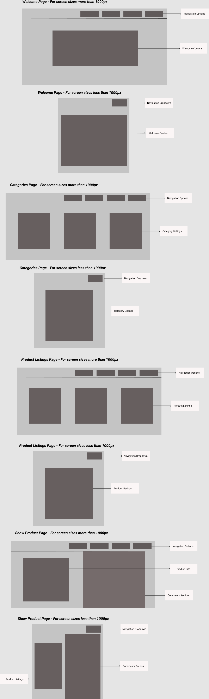

# README

This README would normally document whatever steps are necessary to get the
application up and running.

Things you may want to cover:

* Ruby version

* System dependencies

* Configuration

* Database creation

* Database initialization

* How to run the test suite

* Services (job queues, cache servers, search engines, etc.)

* Deployment instructions

* ...

## Abstraction

Some of the high-level components used in the app

Devise:

Devise is a flexible authentication solution for Rails.
It's composed of 10 modules:

Database Authenticatable: Hashes and stores a password in the database to validate the authenticity of a user while signing in. The authentication can be done both through POST requests or HTTP Basic Authentication.

Confirmable: Sends emails with confirmation instructions and verifies whether an account is already confirmed during sign in.

Recoverable: Resets the user password and sends reset instructions.

Registerable: Handles signing up users through a registration process, also allowing them to edit and destroy their account.

Rememberable: Manages generating and clearing a token for remembering the user from a saved cookie.

Trackable: Tracks sign in count, timestamps and IP address.

Timeoutable: Expires sessions that have not been active in a specified period of time.

Validatable: Provides validations of email and password. It's optional and can be customized, so you're able to define your own validations.

Lockable: Locks an account after a specified number of failed sign-in attempts. Can unlock via email or after a specified time period.

Users are created using devise authentication solution. A user needs to register before buying or listing a product on the marketplace. Each user can list one or many products under one account.

Action View Form Helpers

Forms in web applications are an essential interface for user input. However, form markup can quickly become tedious to write and maintain because of the need to handle form control naming and its numerous attributes. Rails does away with this complexity by providing view helpers for generating form markup.

The main form helper is form_with.
The form used in the app has contains:
* Form element with "GET" method,
* Label for the input,
* Text input element, and
* Submit element.

## Third-Party Services

* AWS S3

In order to implement file uploading, AWS S3 is being used. This allows users to upload images for their product listings. The uploaded images are being stores in S3 bucket.
A product model has_one_attached picture. This allows users to upload product images, that will be stored in S# bucket.
For user with administrative privileges, a new category can be added. The 'Category' model also has_one_attached image, which is uploaded to S3 bucket.

* STRIPE Payment Gateway

Stripe's payment gateway is used to allow users to purchase products using their debit/credit cards.
When the user clicks on buy product button, redirection to stripe's secure payment gateway takes place and user can finalize their purchase by making the payment. 

First, a new stripe session with information about the purchase is created. Also, success and cancel url are setup. These are the urls Stripe will redirect user to if the payment was successful or if they cancelled the payment attempt.
On successful payment, user is redirected back to product listings page.

* Webhooks

A webhook (also called a web callback or HTTP push API) is a way for an app to provide other applications with real-time information. A webhook delivers data to other applications as it happens, meaning you get data immediately. Unlike typical APIs where you would need to poll for data very frequently in order to get it real-time.

Stripe has the ability to listen for an internal event and then send a HTTP request to a predefined URL when that even happens. We have setup Stripe in a way that when a checkout session is complete it will send that information to app.

* Heroku

The app is deployed on heroku, which makes it easier to access the app through a web browser.
URL: https://agile-shelf-22503.herokuapp.com/


## Problem Solving

The marketplace application allows users to buy or sell handicrafts online at a cheap price. 
Currently, there are not too many marketplaces available that allow consumers to buy handicrafts online. Because of this reason, it sounded like a good opportunity to create a marketplace that lists different handicrafts of various types. Also, it allows users to sell their handicrafts.

The marketplace application has a consistent layout, which allows users to navigate through different pages. The application allows user to purchase product through a secure payment gateways. All the user transactions are secure and their credit card information will be secure.

## Models and their relationships

1. User Model

```
class User < ApplicationRecord
  # Include default devise modules. Others available are:
  # :confirmable, :lockable, :timeoutable, :trackable and :omniauthable
  devise :database_authenticatable, :registerable,
         :recoverable, :rememberable, :validatable
  has_many :products
end

```

A User model includes default devise modules. Also, it has one to many relationship with 'Product' module.

2. Product Model

```
class Product < ApplicationRecord  
  belongs_to :category
  belongs_to :user
  has_many :comments
  has_one_attached :picture
  validates :name, :description, :price, presence: true
  validates :price, numericality: true
end
```

A Product model belongs to Category and User models.
It has_one_attached picture - which is stored in aws s3 bucket.
A product model has one to many relationship with Comment model.

3. Category Model

```
class Category < ApplicationRecord
  has_many :products
  has_one_attached :image
end
```

A category model has one to many relationship with Product model.
It has_one_attached image - which is stored in aws s3 bucket.

4. Comment Model

```
class Comment < ApplicationRecord
  belongs_to :product
end

```
A comment belongs to Product and each product has many comments.


## Database Schema(ERD) and Relations



As shown in ER diagram, a list of entities and their relationship is explained below:

* A user entity has email and password attributes

* A product entity has name, description, price as attributes. It also has one attached picture attribute, which enables user to upload image.

* A category entity has name and image_url attributes. It also has one attached image attribute, which enables user to upload image.

* A comment entity has comment attribute.

User and product entities have one to many relationship between them respectively.
Category and product entities have one to many relationship between them respectively.
Product and comment entities have one to many relationship between them respectively.

## User Stories

Some of the user stories are listed below:

* User completes registration(Sign-up) to access marketplace application.

* User logs in to buy or sell products.

* User edits his or her profile from 'My Account' tab to update their personal data.

* User edits or deletes a product listing from 'My Listings' tab to keep his listings up to date.

* User completes payment transaction to buy a product.

* User writes comment about a product to provide review about a product.

* User fills out a form to add a product to sell.

* Administrator adds new category to list products specific to that category.

* Administrator deletes comment,if required which are inappropriate.

* Administrator manages user accounts.


## Wireframes



## Sanitizing and Validation

User input is validated before those details are stored in the database.
If user enters data in an invalid format or leaves some input fields as blank, they are prompted with an error message. They need to fix the errors before the details are stored in the database.

```
class Product < ApplicationRecord  
  belongs_to :category
  belongs_to :user
  has_many :comments
  has_one_attached :picture
  validates :name, :description, :price, presence: true
  validates :price, numericality: true
end
```

Also, user can not delete or edit product listings of other users. This makes sure that inappropriate use of the application does not happen.

For example:
```
<% if current_user.id == @product.user_id %>

<%= form_with(model:@product, url: products_path, local: true) do |form| %>
  <div class="new-product-form">
  <p>
  <%= form.label :name %>
  <%= form.text_field :name %>
  </p>

  <p>
  <%= form.label :description %>
  <%= form.text_field :description %>
  </p>

  <p>
  <%= form.label :price %>
  <%= form.text_field :price %>
  </p>

  <p>
  <%= form.label :category_id %>
  <%= form.select :category_id, Category.all.collect{|c| [c.name,c.id]} %>
  </p>

  <p>
  <%= form.label :picture %>
  <%= form.file_field :picture, accept:
  'image/png,image/gif,image/jpeg,image/jpg'%>
  </p>

  <%= form.submit %>
  </div>
<% end %>

<% else %>

<h5>You are not authorized to edit this product</h5>
<% end %>
```

If the current user is not the one who listed the product and if that user tries to access the edit page, they get a message "You are not authorized to edit this product."

## Tech stack

* HTML
* CSS
* RUBY on Rails
* Visual Studio Code
